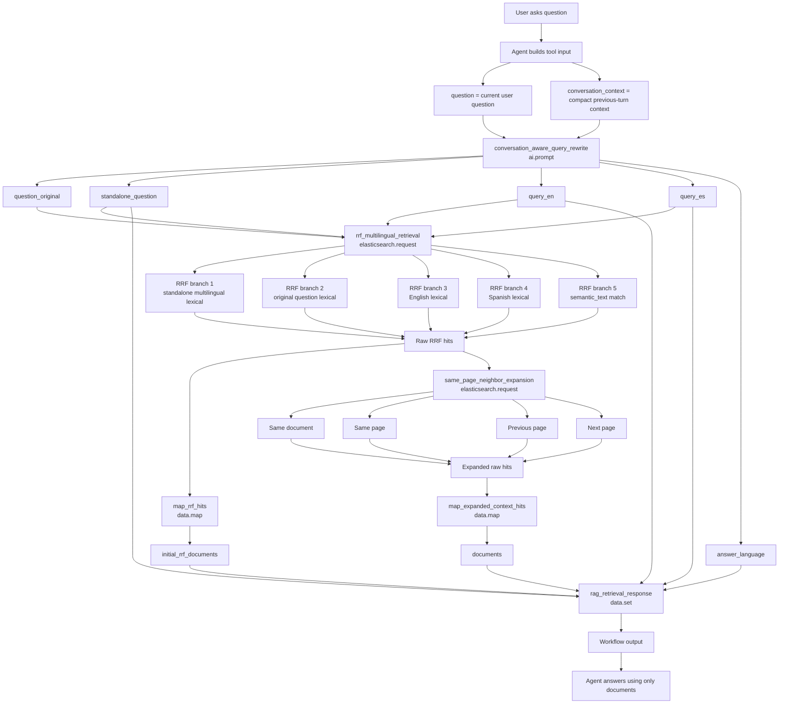

# RAG Workflow Flow — Step by Step

Workflow name: `RAG query retrieval tool v3 conversation aware`

Purpose: receive a user question, rebuild it as a standalone retrieval query when needed, retrieve relevant chunks from Elasticsearch, expand the context around the retrieved chunks, and return documents to the Agent so the Agent can answer with grounding.

---

## 0. Workflow Inputs and Constants

### Inputs

| Variable | Type | Meaning |
|---|---:|---|
| `inputs.question` | `string` | Current user question exactly as asked. |
| `inputs.conversation_context` | `string` | Short summary of previous chat turns needed to resolve follow-up questions. Empty when the question is already standalone. |

### Constants

| Variable | Value | Meaning |
|---|---:|---|
| `consts.indexName` | `open-rag-embeddings-v3` | Elasticsearch index used for retrieval. |
| `consts.resultSize` | `10` | Number of first-stage RRF results returned. |
| `consts.expansionSize` | `30` | Maximum number of expanded neighbor-context chunks returned. |

---

## 1. `conversation_aware_query_rewrite`

### Type

`ai.prompt`

### What this stage does

This stage converts the current user question into retrieval-ready queries.

It handles multi-turn questions like:

> “And what about the second one?”

Using `conversation_context`, it rewrites that into a standalone question, for example:

> “What does the document say about the second ZAR zone?”

It does **not** answer the user. It only prepares search queries.

### Input variables used

| Variable | Used for |
|---|---|
| `inputs.question` | The current raw question. |
| `inputs.conversation_context` | Previous context needed to resolve references like “it”, “that”, “the previous one”, etc. |

### Output variables produced

| Variable | Meaning |
|---|---|
| `steps.conversation_aware_query_rewrite.output.content.question_original` | Exact original user question. |
| `steps.conversation_aware_query_rewrite.output.content.standalone_question` | Self-contained question used as the main retrieval query. |
| `steps.conversation_aware_query_rewrite.output.content.query_en` | English BM25/search variant. |
| `steps.conversation_aware_query_rewrite.output.content.query_es` | Spanish BM25/search variant. |
| `steps.conversation_aware_query_rewrite.output.content.answer_language` | Final answer language: `en` or `es`. |

---

## 2. `rrf_multilingual_retrieval`

### Type

`elasticsearch.request`

### What this stage does

This is the first retrieval stage.

It searches the Elasticsearch index using several retrieval branches and combines them with RRF.

RRF means Reciprocal Rank Fusion: each branch returns ranked results, and Elasticsearch merges those rankings into one final result list.

### Elasticsearch target

| Variable | Value |
|---|---|
| Method | `POST` |
| Path | `/{{ consts.indexName }}/_search` |
| Index resolved as | `/open-rag-embeddings-v3/_search` |

### Main variables used

| Variable | Used for |
|---|---|
| `consts.indexName` | Selects the target index. |
| `consts.resultSize` | Sets search `size`. |
| `standalone_question` | Main rewritten retrieval query. |
| `question_original` | Preserves exact user wording. |
| `query_en` | English lexical retrieval branch. |
| `query_es` | Spanish lexical retrieval branch. |

### Filters applied to all retrieval branches

Only chunks matching these filters are retrieved:

| Field | Required value |
|---|---|
| `record_type` | `chunk` |
| `searchable` | `true` |
| `boilerplate` | `false` |

### Retrieval branches

| Branch | Query variable | Search fields / purpose |
|---|---|---|
| 1 | `standalone_question` | Multilingual lexical search across `content_lex.*`, titles, headings, and file name. |
| 2 | `question_original` | Lexical search using the exact user wording. |
| 3 | `query_en` | English-focused lexical search over `content_lex.en`, titles, and headings. |
| 4 | `query_es` | Spanish-focused lexical search over `content_lex.es`, titles, and headings. |
| 5 | `standalone_question` | Semantic search over `content`, assuming `content` is mapped as `semantic_text`. |

### Source fields returned

Each hit returns these fields:

```text
record_id
chunk_id
document_id
clean_title
title
content
headings
page_start
page_end
source_file_name
language
content_kind
chunk_quality
```

### Output used by next stages

| Variable | Meaning |
|---|---|
| `steps.rrf_multilingual_retrieval.output.hits.hits` | Raw Elasticsearch RRF hits. |

---

## 3. `map_rrf_hits`

### Type

`data.map`

### What this stage does

This stage cleans the raw Elasticsearch hits from the first retrieval stage.

It maps each raw hit into a simpler document object with only the fields the Agent needs.

### Input variables used

| Variable | Meaning |
|---|---|
| `steps.rrf_multilingual_retrieval.output.hits.hits` | Raw first-stage RRF hits. |
| `item._id` | Elasticsearch document ID. |
| `item._score` | Elasticsearch score. |
| `item._source.*` | Chunk metadata and content. |

### Output variables produced per item

| Output field | Source field |
|---|---|
| `elastic_id` | `item._id` |
| `rank` | `item._rank` |
| `score` | `item._score` |
| `record_id` | `item._source.record_id` |
| `chunk_id` | `item._source.chunk_id` |
| `document_id` | `item._source.document_id` |
| `title` | `item._source.title` |
| `clean_title` | `item._source.clean_title` |
| `headings` | `item._source.headings` |
| `content` | `item._source.content` |
| `source_file_name` | `item._source.source_file_name` |
| `language` | `item._source.language` |
| `page_start` | `item._source.page_start` |
| `page_end` | `item._source.page_end` |
| `content_kind` | `item._source.content_kind` |
| `chunk_quality` | `item._source.chunk_quality` |

### Output used later

| Variable | Meaning |
|---|---|
| `steps.map_rrf_hits.output` | Clean first-stage retrieval documents. |

---

## 4. `same_page_neighbor_expansion`

### Type

`elasticsearch.request`

### What this stage does

This stage expands context around the first-stage RRF hits.

For each retrieved chunk, it fetches other chunks from:

- the same document
- the same page
- one page before
- one page after

This gives the Agent more surrounding context than the isolated top chunks.

### Elasticsearch target

| Variable | Value |
|---|---|
| Method | `POST` |
| Path | `/{{ consts.indexName }}/_search` |
| Index resolved as | `/open-rag-embeddings-v3/_search` |
| Required header | `Content-Type: application/json` |

### Main variables used

| Variable | Used for |
|---|---|
| `consts.indexName` | Selects the target index. |
| `consts.expansionSize` | Sets maximum expanded chunks returned. |
| `steps.rrf_multilingual_retrieval.output.hits.hits` | Source hits used to build expansion filters. |
| `hit._source.document_id` | Keeps expansion inside the same source document. |
| `hit._source.page_start` | Start page of the original hit. |
| `hit._source.page_end` | End page of the original hit. |

### Page variables created inside the loop

```liquid


```

Meaning:

| Variable | Meaning |
|---|---|
| `page_start` | Uses `page_start`; if missing, falls back to `page_end`; if also missing, uses `0`. |
| `page_end` | Uses `page_end`; if missing, falls back to `page_start`. |

### Expansion condition

For each first-stage hit, the workflow adds a `should` clause like this:

```json
{
  "term": { "document_id": "same document as original hit" }
}
```

plus page overlap logic:

```json
{ "range": { "page_start": { "lte": page_end + 1 } } }
{ "range": { "page_end": { "gte": page_start - 1 } } }
```

This means:

```text
Return chunks where:
chunk.page_start <= original_hit.page_end + 1
AND
chunk.page_end >= original_hit.page_start - 1
```

So if the original hit is on page 5, the expansion can include chunks overlapping pages 4, 5, and 6.

### Filters applied

| Field | Required value |
|---|---|
| `record_type` | `chunk` |
| `searchable` | `true` |
| `boilerplate` | `false` |

### Output used by next stages

| Variable | Meaning |
|---|---|
| `steps.same_page_neighbor_expansion.output.hits.hits` | Expanded context hits. |

---

## 5. `map_expanded_context_hits`

### Type

`data.map`

### What this stage does

This stage cleans the expanded context hits.

It has the same structure as `map_rrf_hits`, but its input is the expanded context search result instead of the first-stage RRF result.

### Input variables used

| Variable | Meaning |
|---|---|
| `steps.same_page_neighbor_expansion.output.hits.hits` | Raw expanded context hits. |
| `item._id` | Elasticsearch document ID. |
| `item._score` | Elasticsearch score. |
| `item._source.*` | Chunk metadata and content. |

### Output produced

| Variable | Meaning |
|---|---|
| `steps.map_expanded_context_hits.output` | Final cleaned grounding documents returned to the Agent. |

Each document contains:

```text
elastic_id
score
record_id
chunk_id
document_id
title
clean_title
headings
content
source_file_name
language
page_start
page_end
content_kind
chunk_quality
```

---

## 6. `rag_retrieval_response`

### Type

`data.set`

### What this stage does

This is the final workflow response.

It packages the original question, rewritten queries, retrieval metadata, and final documents into one object for the Agent.

### Input variables used

| Variable | Used for |
|---|---|
| `inputs.question` | Returns the original current question. |
| `inputs.conversation_context` | Returns the conversation context used. |
| `standalone_question` | Shows the rewritten standalone query. |
| `query_en` | Shows English retrieval variant. |
| `query_es` | Shows Spanish retrieval variant. |
| `answer_language` | Tells Agent which language to answer in. |
| `steps.map_expanded_context_hits.output` | Final grounding documents. |
| `steps.map_rrf_hits.output` | First-stage RRF documents. |

### Final output fields

| Output field | Meaning |
|---|---|
| `question` | Original current user question. |
| `conversation_context_used` | Conversation context passed by the Agent. |
| `standalone_question` | Conversation-aware rewritten query. |
| `query_en` | English retrieval query. |
| `query_es` | Spanish retrieval query. |
| `answer_language` | Language for final answer. |
| `retrieval_strategy` | Plain description of retrieval strategy. |
| `documents` | Final expanded grounding chunks. This is what the Agent should answer from. |
| `initial_rrf_documents` | First-stage RRF chunks before expansion. Useful for debugging. |
| `instruction` | Final instruction for grounded answering. |

---

# Complete Flow

```text
User question
    ↓
Agent passes:
- question
- conversation_context
    ↓
Workflow rewrites question
    ↓
Workflow retrieves first-stage RRF hits
    ↓
Workflow maps first-stage hits
    ↓
Workflow expands same-page / neighboring-page context
    ↓
Workflow maps expanded hits
    ↓
Workflow returns documents
    ↓
Agent answers using only returned documents
```

---

# Mermaid Diagram


