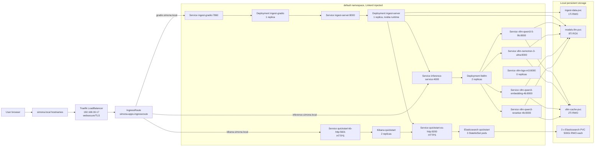

# Ingest Server Kubernetes Architecture

Snapshot date: 2026-06-09.

This document describes the live Kubernetes architecture for the `ingest-server-orquestator` stack. It is based on the current cluster context `default`, Kubernetes resources, ECK/Elasticsearch API state, and the application source in this repository. Secret values were not copied into this document.

## Cluster Summary

| Area | Live value |
| --- | --- |
| Kubernetes distribution | k3s `v1.35.5+k3s1` |
| Node | `servergpu` |
| Node roles | `control-plane` |
| Node IP | `192.168.30.17` |
| OS/runtime | Ubuntu 24.04.4 LTS, containerd `2.2.3-k3s1` |
| RuntimeClass for GPU workloads | `nvidia` |
| Main app namespace | `default` |
| Mesh | Linkerd `edge-26.6.1`, `default` namespace annotated `linkerd.io/inject=enabled` |
| Ingress controller | Traefik `3.6.13`, LoadBalancer IP `192.168.30.17` |
| TLS issuer | cert-manager `ClusterIssuer/simona-ca` |
| Elastic operator | ECK `3.4.0` |

Namespaces observed:

| Namespace | Purpose |
| --- | --- |
| `default` | ingest app, Gradio app, LiteLLM, vLLM, Elasticsearch, Kibana |
| `traefik` | Traefik ingress controller |
| `linkerd` | Linkerd control plane |
| `linkerd-viz` | Linkerd metrics, tap, Prometheus, web UI |
| `elastic-system` | ECK operator |
| `cert-manager` | cert-manager controller, cainjector, webhook |
| `kube-system` | k3s core services, CoreDNS, metrics-server, local-path-provisioner |

## High-Level Diagram

## Ingress And Edge Routing

Traefik runs in namespace `traefik` as a single replica and is itself injected with Linkerd in ingress mode. The LoadBalancer service exposes:

| Port | NodePort | Purpose |
| --- | --- | --- |
| `80/TCP` | `30713` | Traefik `web` entrypoint |
| `443/TCP` | `31527` | Traefik `websecure` entrypoint |
| `9000/TCP` | `31594` | Traefik dashboard/API entrypoint |

The active `IngressRoute/default/simona-apps-ingressroute` uses entrypoint `websecure` and TLS secret `simona-apps-tls`.

| Host | Backend service | Backend port | Notes |
| --- | --- | --- | --- |
| `inference.simona.local` | `inference-service` | `4000` | LiteLLM proxy for chat, embeddings, and rerank APIs |
| `gradio.simona.local` | `ingest-gradio` | `7860` | Public file upload UI |
| `kibana.simona.local` | `quickstart-kb-http` | `5601` | HTTPS to ECK Kibana, Traefik `ServersTransport` skips upstream cert verification |
| `openwebui.simona.local` | `openwebui-service` | `8080` | Route exists, but no matching Service is present in the live namespace |

The route uses Linkerd header middlewares:

| Middleware | Header target |
| --- | --- |
| `l5d-inference-service` | `inference-service.default.svc.cluster.local:4000` |
| `l5d-gradio-service` | `ingest-gradio.default.svc.cluster.local:7860` |
| `l5d-kibana-service` | `quickstart-kb-http.default.svc.cluster.local:5601` |
| `l5d-openwebui-service` | `openwebui-service.default.svc.cluster.local:8080` |

cert-manager status:

| Resource | Status |
| --- | --- |
| `ClusterIssuer/simona-ca` | Ready, signing CA verified |
| `Certificate/default/simona-apps-tls` | Ready, secret `simona-apps-tls` |

## Application Services

### Gradio Upload UI

| Field | Value |
| --- | --- |
| Deployment | `default/ingest-gradio` |
| Replicas | `1/1` |
| Image | `ingest-server-orquestator:latest` |
| Command | `python gradio_file_ingest/app.py` |
| Service | `ingest-gradio:7860` |
| Backend URL | `http://ingest-server.default.svc.cluster.local:8000` |
| Job poll interval | `3s` |
| Request timeout | `60s` |

The Gradio app posts multipart uploads to `/api/v1/ingest/file` and polls `/api/v1/ingest/jobs`.

### Ingest API And Worker

| Field | Value |
| --- | --- |
| Deployment | `default/ingest-server` |
| Replicas | `1/1` |
| Image | `ingest-server-orquestator:latest` |
| RuntimeClass | `nvidia` |
| Command | `python -m uvicorn src.main:app --host 0.0.0.0 --port 8000` |
| Service | `ingest-server:8000` |
| Public ingress | None, called internally by Gradio |
| Upload path | `/uploads` from `ingest-data-pvc` |
| Markdown output path | `/outputs` from `ingest-data-pvc` |
| Tokenizer path | `/tokenizer`, read-only from `models-llm-pvc` |
| Docling model path | `/docling-models`, read-only from `models-llm-pvc` |

Live ConfigMap values include:

| Config key | Live value |
| --- | --- |
| `APP_ENV` | `prod` |
| `INGEST_WORKER_MAX_WORKERS` | `1` |
| `NVIDIA_VISIBLE_DEVICES` | `4` |
| `DOCLING_OCR_ENGINE` | `surya` |
| `DOCLING_OCR_LANGS` | `es,en` |
| `DOCLING_CODE_ENRICHMENT_ENABLED` | `false` |
| `DOCLING_SURYA_INFERENCE_URL` | `http://surya-vllm:8000/v1` |
| `DOCLING_PICTURE_DESCRIPTION_URL` | `http://inference-service.default.svc.cluster.local:4000/v1/chat/completions` |
| `ELASTIC_HOSTS` / `ELASTIC_URL` | `https://quickstart-es-http.default.svc.cluster.local:9200` |
| `ELASTIC_INDEX_NAME` | `open-rag-embeddings-v3` |
| `ELASTIC_PIPELINE_NAME` | `open_rag_embeddings_v3_multilingual_semantic_pipeline` |
| `ELASTIC_INFERENCE_ID` | `openai-text_embedding-qwen3-embedding-4b` |
| `ELASTIC_BULK_BATCH_SIZE` | `20` |
| `ELASTIC_VERIFY_CERTS` | `false` |

Secret values are provided from `Secret/default/ingest-server-secrets`. The live Deployment references that Secret through `envFrom`, but the secret data is intentionally not documented here.

## LiteLLM And vLLM Inference

LiteLLM runs as the in-cluster API gateway for all model-serving backends.

| Field | Value |
| --- | --- |
| Deployment | `default/litellm` |
| Replicas | `2/2` |
| Image | `ghcr.io/berriai/litellm:main-latest` |
| Service | `inference-service:4000` |
| Health | `/health/readiness` reported healthy |
| LiteLLM version | `1.82.6` |
| Database | Not connected |

LiteLLM model routes:

| LiteLLM model name | Backend service |
| --- | --- |
| `Qwen3.5-9B` | `http://vllm-qwen3-5-9b:8000/v1` |
| `Nemotron-3-Ultra-550B-A55B` | `http://vllm-nemotron-3-ultra:8000/v1` |
| `Qwen3-Embedding-4B` | `http://vllm-qwen3-embedding-4b:8000/v1` |
| `bge-m3-pooling` | `http://vllm-bge-m3:8000` |
| `Qwen3-Reranker-4B` | `http://vllm-qwen3-reranker-4b:8000` |

vLLM deployments:

| Deployment | Replicas | Served model | GPU visibility | Key notes |
| --- | --- | --- | --- | --- |
| `vllm-nemotron-3-ultra` | `1/1` | `Nemotron-3-Ultra-550B-A55B` | `0,1,2,3` | Tensor parallel size 4, expert parallel enabled, max model length 262144 |
| `vllm-qwen3-5-9b` | `1/1` | `Qwen3.5-9B` | `4` | Chat/completion model, max model length 32768 |
| `vllm-qwen3-embedding-4b` | `1/1` | `Qwen3-Embedding-4B` | `4` | Embedding model, max model length 32768 |
| `vllm-qwen3-reranker-4b` | `1/1` | `Qwen3-Reranker-4B` | `4` | Pooling runner for rerank |
| `surya-vllm` | `1/1` | `datalab-to/surya-ocr-2` | `0` | Surya OCR 2 VLM, vLLM image `vllm/vllm-openai:v0.20.1`, service URL `http://surya-vllm:8000/v1` |
| `vllm-bge-m3` | `0/0` | `bge-m3` | `4` | Configured in LiteLLM, but no live endpoints while scaled to zero |

Active vLLM deployments use `runtimeClassName: nvidia`, `models-llm-pvc`
mounted at `/model`, `vllm-cache-pvc` at `/root/.cache/vllm`, and
memory-backed `/dev/shm`. Most use image `vllm/vllm-openai:latest`; Surya OCR 2
is pinned to `vllm/vllm-openai:v0.20.1` to match Surya's default vLLM backend.

## Elastic And Kibana

The Elastic stack is managed by ECK.

### Elasticsearch

| Field | Value |
| --- | --- |
| ECK resource | `Elasticsearch/default/quickstart` |
| Version | `9.4.2` |
| Phase | `Ready` |
| Health | `green` |
| StatefulSet | `quickstart-es-default` |
| Pods | `3/3` |
| Service | `quickstart-es-http:9200` |
| Storage | 3 PVCs, 500Gi each, `elastic-local-path` |
| Node selector | `kubernetes.io/hostname=servergpu` |
| Resources per ES container | request `8 CPU`, `32Gi`; limit `32Gi` memory |

Elasticsearch API state:

| Field | Value |
| --- | --- |
| Cluster name | `quickstart` |
| Active data nodes | `3` |
| Active shard percent | `100%` |
| RAG index | `open-rag-embeddings-v3` |
| RAG index default pipeline | `open_rag_embeddings_v3_multilingual_semantic_pipeline` |
| RAG index documents | `3372` chunks from `17` document IDs |

### Kibana

| Field | Value |
| --- | --- |
| ECK resource | `Kibana/default/quickstart` |
| Version | `9.4.2` |
| Health | `green` |
| Replicas | `2/2` |
| Service | `quickstart-kb-http:5601` |
| Elasticsearch association | Established |
| Ingress host | `kibana.simona.local` |

## RAG Index And Inference Endpoints

The live RAG index is `open-rag-embeddings-v3`.

| Mapping field | Purpose |
| --- | --- |
| `content` | `semantic_text` field with inference ID `openai-text_embedding-qwen3-embedding-4b` |
| `content_lex.en` | English BM25 field |
| `content_lex.es` | Spanish BM25 field |
| `content_lex.fr` | French BM25 field |
| `document_id` | Upload/job document identifier |
| `chunk_id` | Stable chunk identifier, also used as Elasticsearch `_id` |
| `page_number`, `page_numbers` | Page metadata from Docling chunk provenance |
| `source_file_name`, `title`, `clean_title` | Source and title metadata |
| `record_type`, `searchable`, `boilerplate`, `content_kind` | Retrieval filters and helpers |

Live Elastic inference endpoints relevant to this stack:

| Inference ID | Task | Routed URL |
| --- | --- | --- |
| `openai-chat_completion-nemotron-3-ultra` | chat completion | `http://inference-service.default.svc.cluster.local:4000/v1/chat/completions` |
| `openai-text_embedding-qwen3-embedding-4b` | text embedding | `http://inference-service.default.svc.cluster.local:4000/v1/embeddings` |
| `qwen3-reranker-4b` | rerank | `http://inference-service.default.svc.cluster.local:4000/v2/rerank` |
| `elastic-rerank-v1` | rerank | Native Elastic inference |
| `.elser-2-elasticsearch` | sparse embedding | Native Elastic inference |
| `.multilingual-e5-small-elasticsearch` | text embedding | Native Elastic inference |

The live RAG workflow is stored in Elasticsearch index `.workflows-workflows-000001` with ID `rag-query-retrieval-tool-v3-conversation-aware`. It is enabled and was updated on `2026-06-09T11:20:11.273Z`.

## Storage

| PVC | Capacity | Access mode | StorageClass | Used by |
| --- | --- | --- | --- | --- |
| `ingest-data-pvc` | `1Ti` | `RWO` | `local-storage` | `/uploads`, `/outputs` for `ingest-server` |
| `models-llm-pvc` | `8Ti` | `ROX` | `local-storage` | vLLM model mounts, ingest tokenizer, Docling models |
| `vllm-cache-pvc` | `2Ti` | `RWO` | `local-storage` | vLLM cache directories |
| `elasticsearch-data-quickstart-es-default-0` | `500Gi` | `RWO` | `elastic-local-path` | ES pod 0 |
| `elasticsearch-data-quickstart-es-default-1` | `500Gi` | `RWO` | `elastic-local-path` | ES pod 1 |
| `elasticsearch-data-quickstart-es-default-2` | `500Gi` | `RWO` | `elastic-local-path` | ES pod 2 |

PersistentVolume reclaim policies observed:

| PV group | Reclaim policy |
| --- | --- |
| `ingest-data-pv`, `models-llm-pv`, `vllm-cache-pv` | `Retain` |
| ECK local-path PVs | `Retain` |

## Live-State Notes

- `openwebui.simona.local` is routed in the IngressRoute, but `openwebui-service` is not present in the live `default` namespace.
- `vllm-bge-m3` is configured in LiteLLM, but the deployment is scaled to zero, so `bge-m3-pooling` has no backing endpoint until that deployment is scaled up.
- `kubectl get networkpolicy -A` returned no live NetworkPolicy resources. The checked-in `k8s/ingest-server.yaml` contains a Gradio-to-ingest NetworkPolicy, but it is not currently applied.
- The live `ingest-server-config` differs from older checked-in manifest defaults. The live cluster points ingest traffic to ECK Elasticsearch and LiteLLM service DNS names.
- Internal ECK HTTP services use TLS. The Traefik `kibana-eck-transport` currently sets `insecureSkipVerify: true` for the Kibana upstream certificate.
