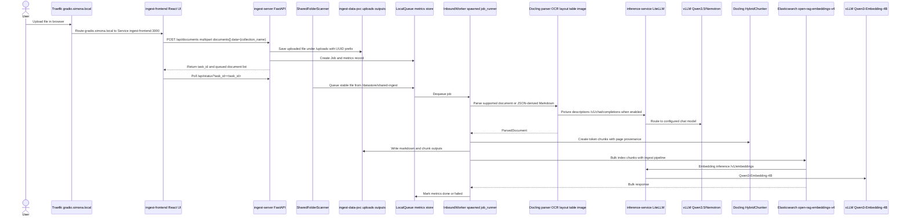
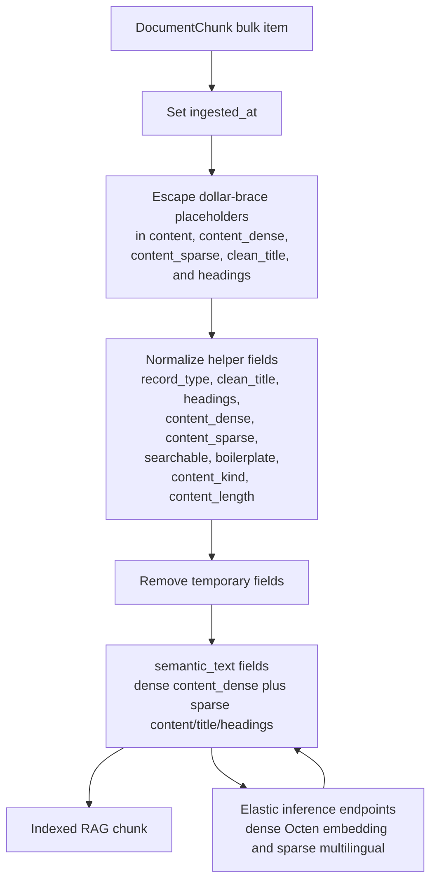
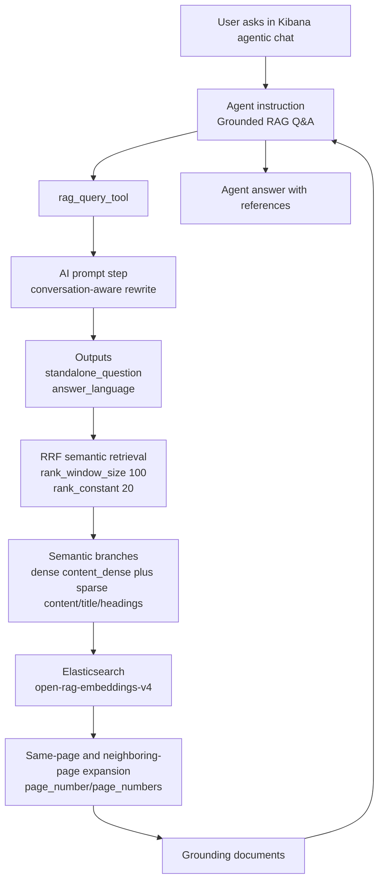

# Ingest Server Pipeline Workflow

This document describes the maintained runtime path from a user upload or shared
folder drop to indexed Elasticsearch chunks and RAG retrieval. It is based on
the checked-in source code and manifests. Concrete cluster counts, document
counts, and pod health can drift; use `k8s/` and the live cluster for those.

For class-level details, see `docs/python-class-guide.md`.

## End-To-End Summary

1. A user opens `https://gradio.simona.local`, which Traefik routes to the React frontend, and uploads one or more files.
2. The frontend posts selected files to the internal ingest API at `http://ingest-server:8000/api/documents?blocking=false` using NVIDIA RAG frontend-compatible multipart fields.
3. The FastAPI ingest server writes the uploaded file to `/uploads`, creates a `Job`, records in-memory metrics, and enqueues the job in a process-local queue.
4. Alternatively, `SharedFolderScanner` polls `/datastore/shared-ingest`, creates a `Job` for stable new or changed files, and enqueues it.
5. The API process has an `InboundWorker` thread running. It dequeues jobs and starts a spawned worker process with `ProcessPoolExecutor`.
6. The worker parses supported files with `DoclingParser`: PDF, Markdown, arbitrary JSON, DOCX, PPTX, XLSX, HTML, EML, and images. JSON is preprocessed to Markdown before conversion; PDFs and images use local model artifacts and OCR settings from `ingest-server-config`.
7. Docling picture description calls go to the configured OpenAI-compatible chat endpoint.
8. The parsed Docling document is chunked by `DoclingChunker` with a HuggingFace tokenizer from `/tokenizer`; chunks include page, source, title, token count, headings, and Docling item metadata.
9. The worker writes Markdown and per-chunk JSON output to disk.
10. `ElasticsearchDispatch` bulk indexes the chunks into Elasticsearch index `open-rag-embeddings-v4` through pipeline `open_rag_embeddings_v4_multilingual_semantic_pipeline`.
11. The Elasticsearch pipeline normalizes metadata and indexes dense and sparse semantic fields through Elastic inference endpoints.
12. A user opens `https://kibana.simona.local`, asks a question in agentic chat, and the RAG workflow searches indexed chunks.
13. The workflow rewrites the question, runs semantic RRF retrieval, expands same-page and neighboring-page context, and returns grounding documents to the agent.
14. The agent answers only from returned documents and includes references with file, page, and chunk metadata.

## Ingestion Diagram



## Upload And API Stage

The React frontend is implemented in `frontend/` and is based on the NVIDIA RAG Blueprint frontend. The FastAPI adapter in `api/frontend_adapter.py` exposes the NVIDIA-compatible `/api/*` contract while the legacy ingest endpoints remain available.

| Runtime config | Checked-in value |
| --- | --- |
| `INGEST_API_URL` | `http://ingest-server:8000` |
| Public frontend host | `https://gradio.simona.local` |
| Frontend upload endpoint | `/api/documents?blocking=false` |
| Frontend task endpoint | `/api/status?task_id=<task_id>` |
| Frontend collections endpoint | `/api/collections` |
| Legacy upload endpoint | `/api/v1/ingest/file` |
| Legacy case endpoint | `/api/v1/ingest/case` |
| Legacy jobs endpoint | `/api/v1/ingest/jobs` |

For selected files, the React frontend:

- Posts repeated multipart field `documents`.
- Posts JSON form field `data` containing `collection_name`, metadata, and frontend options.
- Receives a `task_id`.
- Polls `/api/status` and refreshes collections/documents through the NVIDIA frontend stores.

The FastAPI service is implemented in `src/main.py`.

When `POST /api/documents` receives files, it:

- Sanitizes each filename with `Path(...).name`.
- Saves each file to `/uploads/<uuid>-<filename>`.
- Creates one normal ingest `Job` per file with `parser_type=docling`, `chunker_type=token`, collection metadata, MIME type, size, task id, and stored path.
- Creates a metrics record for each job.
- Puts each job in the singleton `LocalQueue`.
- Returns the `task_id`, collection name, and queued document payload expected by the NVIDIA frontend.

The frontend adapter and legacy jobs endpoints read the in-memory metrics store:

| Endpoint | Purpose |
| --- | --- |
| `GET /api/collections` | Return the configured Elasticsearch index and any frontend-created collection catalog records |
| `POST /api/collection` | Register a frontend collection catalog record mapped to this ingest server |
| `POST /api/documents` | Queue one ingest job per uploaded document |
| `GET /api/documents?collection_name=...` | List documents from job metrics for a collection |
| `GET /api/status?task_id=...` | Return NVIDIA task state derived from grouped job metrics |
| `GET /api/health` / `GET /api/configuration` | Return frontend health and configuration defaults |
| `GET /api/v1/ingest/jobs` | List jobs, optionally filtered by `status` and `stage` |
| `GET /api/v1/ingest/jobs/{job_id}` | Return one metrics record |
| `GET /api/v1/ingest/jobs/{job_id}/output` | Return generated Markdown output from `/outputs` or shared ingest output |
| `POST /api/v1/ingest/case` | Queue Markdown case content into the `case-rag` index |

## Worker And Parsing Stage

The FastAPI lifespan startup creates:

- A multiprocessing-backed metrics store when available.
- An `InboundWorker` thread.
- A `ProcessPoolExecutor` with `max_workers=INGEST_WORKER_MAX_WORKERS`.
- A `SharedFolderScanner` thread when `SHARED_INGEST_ENABLED=true`.

Checked-in worker settings:

| Setting | Checked-in value |
| --- | --- |
| `INGEST_WORKER_MAX_WORKERS` | `1` |
| Process start method | `spawn` |
| `max_tasks_per_child` | `1` |
| GPU visibility | `NVIDIA_VISIBLE_DEVICES=4` |
| RuntimeClass | `nvidia` |

The worker flow is implemented in `workers/inbound_worker.py` and `workers/job_runner.py`.

For each job, `job_runner`:

1. Configures CUDA and torch matmul precision.
2. Marks the job as running.
3. Creates `DoclingParser`.
4. Parses the document.
5. Creates `DoclingChunker`.
6. Chunks the parsed document.
7. Writes Markdown and chunk JSON outputs.
8. Creates `ElasticsearchDispatch`.
9. Bulk indexes chunks.
10. Marks metrics done or failed.
11. Updates shared ingest state when the source is `shared-folder`.

Docling parser settings come from `ingest-server-config`.

| Area | Checked-in value |
| --- | --- |
| Parser | `docling` |
| OCR enabled | `true` |
| OCR engine | `surya` |
| OCR languages | `es,en` |
| Surya inference URL | `http://surya-vllm:8000/v1` |
| Layout batch size | `4` |
| OCR batch size | `8` |
| Table batch size | `8` |
| Queue max size | `16` |
| Full page OCR | `false` |
| Code enrichment | `false` |
| Shared ingest root | `/datastore/shared-ingest` |
| Picture description URL | `http://vllm-qwen35-9b:8007/v1/chat/completions` |

The Docling parser:

- Allows PDF, Markdown, arbitrary JSON, DOCX, PPTX, XLSX, HTML, EML, and image input. JSON is converted to Markdown before Docling conversion. MSG is rejected because the installed Docling API exposes email support as EML.
- Uses local artifacts from `/docling-models`.
- Uses PPDocLayout model path from the mounted model volume.
- Can select EasyOCR, MinerU, Surya OCR 2, RapidOCR, or Docling auto OCR through
  `DOCLING_OCR_ENGINE`.
- Can enable Docling code enrichment with `DOCLING_CODE_ENRICHMENT_ENABLED=true`.
- Enables table structure extraction with accurate TableFormer mode.
- Enables picture classification and picture description.
- Sends picture descriptions to the configured endpoint with model
  `DOCLING_PICTURE_DESCRIPTION_MODEL` (`Qwen3.5-9B` by default).
- Produces a `ParsedDocument` containing `document_id`, `source_file_name`, source path, MIME type, title, page count, and the raw Docling document.

## Shared Folder Ingest

Shared folder ingest is implemented in `workers/shared_ingest.py` and is enabled
by the checked-in k3s ConfigMap.

Expected disk layout:

```text
/datastore/shared-ingest/
  <collection-name>/
    file.pdf
    output/
      .ingest-state.json
      <job_id>/
        <title> output.md
        chunks/*.json
```

The scanner:

- Ensures collection output folders exist for the configured index and any
  discoverable `open-rag-*` Elasticsearch indices.
- Ignores hidden files and partial download suffixes.
- Waits `SHARED_INGEST_STABLE_SECONDS` before queuing a file.
- Uses path, `mtime_ns`, and file size as the file identity.
- Requeues a file when that identity changes.
- Writes queue/done/failed state to `.ingest-state.json`.

## Chunking Stage

Chunking is implemented in `processing/chunking/docling_chunker.py`.

The chunker:

- Uses Docling `HybridChunker`.
- Loads the Qwen3 tokenizer from `/tokenizer`.
- Uses `min(chunk_max_tokens, 512)` for Docling `HybridChunker` token
  chunking so pre-chunked `content_sparse` stays below the sparse inference
  budget.
- Emits Markdown-like documents without pages as one chunk when the full exported
  Markdown is at or below `512` tokenizer tokens. Larger Markdown-like
  documents still use Docling token chunking.
- Repeats table headers across split table chunks.
- Uses contextualized chunk text where available.
- Splits any contextualized chunk that still exceeds `512` tokenizer tokens
  into token windows with a `100` token overlap before creating
  `DocumentChunk` records.
- Coalesces adjacent chunks below `128` tokenizer tokens when the merged chunk
  still fits within the configured sparse-token budget. This reduces isolated
  heading or label chunks while preserving the `512` token hard cap.
- Keeps contextualized chunk text in `content` and lets the ingest pipeline copy it
  into generated `content_dense` and `content_sparse` search fields.
- Extracts Docling item references and page numbers from chunk provenance.

Each indexed `DocumentChunk` includes:

| Field | Meaning |
| --- | --- |
| `content` | Contextualized chunk text stored in `_source` for returned passages |
| `content_dense` | Generated dense semantic search copy, excluded from `_source` |
| `content_sparse` | Generated sparse semantic search copy, excluded from `_source` |
| `document_id` | The ingest `job_id` |
| `chunk_id` | `<job_id>-<zero-padded chunk index>` |
| `chunk_index` | Numeric chunk order |
| `chunking_strategy` | `token` |
| `content_token_count` | Token count from tokenizer |
| `doc_items` | Docling item references |
| `page_number` | First page in the chunk provenance |
| `page_numbers` | All unique pages in the chunk provenance |
| `total_pages` | Total pages in the parsed document |
| `title` | Cleaned document title discovered by Docling or derived from the filename |
| `clean_title` | Sanitized title indexed with sparse semantic inference |
| `headings` | Docling heading hierarchy attached to the chunk |
| `source_file_name` | Original upload filename |

## Elasticsearch Indexing Stage

Indexing is implemented in `dispatcher/elastic/elastic.py`.

The dispatcher connects to:

| Config | Checked-in value |
| --- | --- |
| `ELASTIC_HOSTS` | `https://elasticsearch-gpu-indexer:9200` |
| Index | `open-rag-embeddings-v4` |
| Pipeline | `open_rag_embeddings_v4_multilingual_semantic_pipeline` |
| Ingest inference ID | `text_embedding-octen-embedding-4b_ingest` |
| Search inference ID | `text_embedding-octen-embedding-4b_search` |
| Bulk batch size | `10` |
| Bulk timeout | `30m` |
| Bulk request timeout | `1800s` |
| Certificate verification | `false` |

`ElasticsearchDispatch` upserts the managed ingest pipeline, creates the index when absent, then indexes chunks in bulk. Existing index mappings are not patched in place; recreate the index to pick up mapping changes. Each bulk item uses:

- `_index`: `open-rag-embeddings-v4`
- `_id`: `chunk.chunk_id`
- pipeline: `open_rag_embeddings_v4_multilingual_semantic_pipeline`
- `refresh=wait_for`
- `wait_for_active_shards=1`

Index document counts, shard state, and language splits are live cluster state
and are intentionally not pinned in this source document.

## Ingest Pipeline Details

The checked-in ingest pipeline name is `open_rag_embeddings_v4_multilingual_semantic_pipeline`.



Pipeline processors:

| Step | Processor | Effect |
| --- | --- | --- |
| 1 | `set` | Adds `ingested_at` from `_ingest.timestamp` if absent |
| 2 | `script` | Escapes `${` in `content`, `content_dense`, `content_sparse`, `clean_title`, and `headings` to avoid custom inference template conflicts |
| 3 | `script` | Sets `record_type=chunk`, sanitizes filename-style titles into `clean_title`, normalizes `headings`, populates `content_dense` and `content_sparse`, sets `content_length`, `searchable=true`, `boilerplate=false`, `content_kind=chunk` |
| 4 | `remove` | Removes temporary or legacy fields |
| failure | `set` | Writes failures to `ingest_error` |

The index mapping stores returned chunk text in `content` as indexed plain text. It stores `content_dense` as dense `semantic_text` with ingest endpoint `text_embedding-octen-embedding-4b_ingest` and search endpoint `text_embedding-octen-embedding-4b_search`. It stores `content_sparse`, `clean_title`, and `headings` as sparse `semantic_text` with inference endpoint `naver-splade-v3`. Large generated fields (`content_dense` and `content_sparse`) are excluded from `_source` while remaining searchable. Titles and headings remain in `_source`. Automatic semantic chunking is disabled because the app already pre-chunks documents.

## Kibana Agentic Chat Retrieval

The checked-in workflow artifact is `elastic_integration/rag-workflow.yml`.
Production may store an imported copy in Elasticsearch/Kibana Agent Builder.

| Field | Value |
| --- | --- |
| Workflow ID | `rag-query-retrieval-tool-v4-conversation-aware` |
| Name | `RAG query retrieval tool v4 conversation aware` |
| Index constant | `open-rag-embeddings-v4` |
| Result size | `10` |
| Expansion size | `30` |

The agent instruction artifact in the repository is `elastic_integration/rag-AGENT.md`. It tells the agent to call `rag_query_tool` for document-grounded questions and to answer only from returned passages.

## Retrieval Diagram



## Retrieval Workflow Steps

### 1. Conversation-Aware Rewrite

The workflow receives:

| Input | Description |
| --- | --- |
| `question` | The latest user question exactly as asked |
| `conversation_context` | A compact summary of relevant previous turns, empty when not needed |

The `ai.prompt` step rewrites follow-up questions into standalone retrieval queries. It returns:

| Output | Purpose |
| --- | --- |
| `question_original` | Exact current user question |
| `standalone_question` | Self-contained retrieval question |
| `answer_language` | `en` or `es` |

### 2. First-Stage RRF Retrieval

The workflow searches `/open-rag-embeddings-v4/_search` with an RRF retriever.

Global filters:

| Filter | Required value |
| --- | --- |
| `record_type` | `chunk` |
| `searchable` | `true` |
| `boilerplate` | `false` |

Retrieval branches:

| Branch | Query text | Fields |
| --- | --- | --- |
| Dense content semantic | `standalone_question` | `content_dense` semantic_text |
| Sparse content semantic | `standalone_question` | `content_sparse` sparse semantic_text |
| Sparse title semantic | `standalone_question` | `clean_title` sparse semantic_text |
| Sparse heading semantic | `standalone_question` | `headings` sparse semantic_text |

The workflow maps first-stage hits into `initial_rrf_documents`.

### 3. Context Expansion

The live workflow expands from the first-stage hits using `page_number` and `page_numbers`, which match the current ingest schema.

For each first-stage hit, it:

- Reads `page_numbers` when available, otherwise `page_number`.
- Computes a page window from one page before to one page after the hit.
- Searches chunks with the same `document_id`.
- Keeps `record_type=chunk`, `searchable=true`, and `boilerplate=false`.
- Returns up to `30` expanded chunks.

The workflow maps expanded hits into `documents`, which is the primary grounding set for the agent.

### 4. Agent Answer

The workflow returns:

| Output | Purpose |
| --- | --- |
| `documents` | Expanded grounding chunks used for the answer |
| `initial_rrf_documents` | First-stage RRF hits, useful for diagnostics |
| `standalone_question` | Retrieval trace field |
| `answer_language` | Language for the final answer |
| `instruction` | Grounding contract for the agent |

The agent instruction requires:

- Use `documents` first.
- Answer only from returned passages.
- Say the available documents are insufficient when grounding is missing.
- Do not invent page numbers, filenames, citations, URLs, or facts.
- Finish with references containing filename, page, chunk, and heading/context.

## Model And Service Interactions

| Stage | Caller | Target | Purpose |
| --- | --- | --- | --- |
| Picture description during parsing | Docling parser in `ingest-server` | LiteLLM `/v1/chat/completions` | Describe images in parsed PDFs/images |
| Picture description backend | LiteLLM | `vllm-qwen3-5-9b` or configured chat model | Generate descriptions |
| Chunk embedding during indexing | Elasticsearch `semantic_text` inference | LiteLLM `/v1/embeddings` | Create semantic vectors |
| Embedding backend | LiteLLM | `vllm-qwen3-embedding-4b` | Serve `Qwen3-Embedding-4B` |
| Query rewrite in workflow | Kibana/Elastic workflow AI prompt | Elastic AI provider configuration | Rewrite user query and produce retrieval variants |
| Semantic query branch | Elasticsearch | `content_dense` semantic_text | Retrieve semantically similar chunks |
| Optional rerank endpoint | Elastic inference endpoint `qwen3-reranker-4b` | LiteLLM `/v2/rerank` | Available in cluster, not used by the live RAG workflow |

## Operational Notes

- The ingest queue and metrics store are process-local/in-memory. A pod restart can lose queued job state and dashboard history that was not already indexed.
- `INGEST_WORKER_MAX_WORKERS=1` serializes processing, which reduces GPU contention for Docling OCR and model calls.
- The RAG workflow stored in Elasticsearch is the runtime source of truth. The checked-in `elastic_integration/rag-workflow.yml` may lag the live workflow.
- `vllm-bge-m3` is scaled to zero. The LiteLLM model `bge-m3-pooling` will not work until that deployment has endpoints.
- The checked-in Kubernetes manifest defines the React frontend Service, Traefik `simona-apps-ingressroute`, Linkerd destination middlewares, and frontend/API NetworkPolicies. Apply `k8s/ingest-server.yaml` to route `gradio.simona.local` to `ingest-frontend:3000`.
- Secret-backed values such as `ELASTIC_API_KEY` are required at runtime but are intentionally not included in this document.
