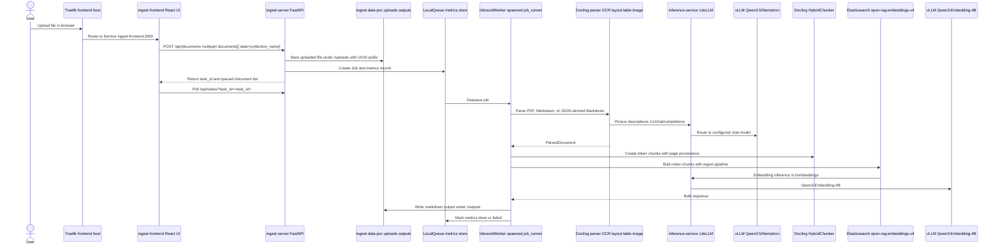
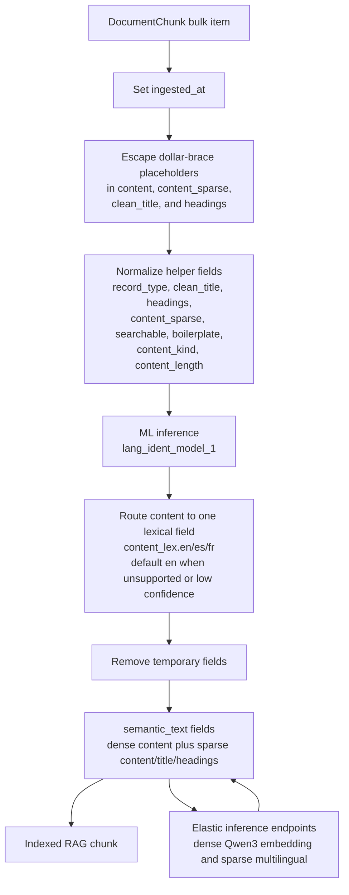
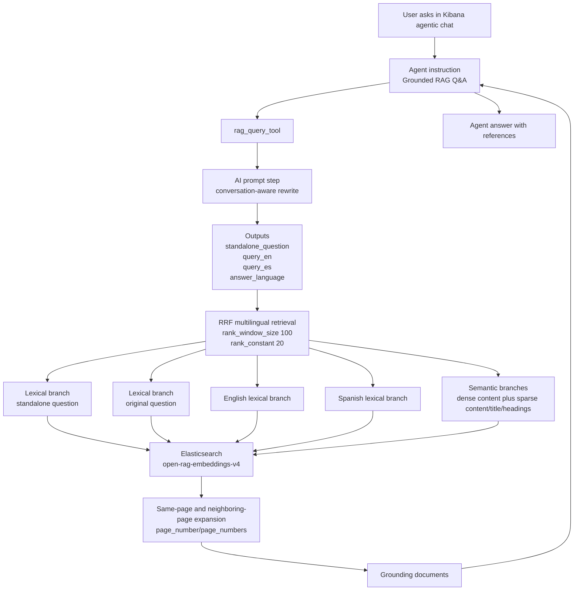

# Ingest Server Pipeline Workflow

Snapshot date: 2026-06-09.

This document describes the full runtime path from a user uploading a file in the NVIDIA RAG React frontend to a user asking a grounded question in Kibana agentic chat and retrieving indexed document chunks. It combines Kubernetes state, Elasticsearch/Kibana workflow state, and repository source code.

## End-To-End Summary

1. A user opens the React frontend through Traefik and uploads one or more files.
2. The frontend posts selected files to the internal ingest API at `http://ingest-server.default.svc.cluster.local:8000/api/documents?blocking=false` using NVIDIA RAG frontend-compatible multipart fields.
3. The FastAPI ingest server writes the uploaded file to `/uploads`, creates a `Job`, records in-memory metrics, and enqueues the job in a process-local queue.
4. The API process already has an `InboundWorker` thread running. It dequeues jobs and starts a spawned worker process with `ProcessPoolExecutor`.
5. The worker parses the PDF, Markdown, or JSON file with Docling, preprocessing arbitrary JSON to Markdown before conversion and using local model artifacts and OCR settings from `ingest-server-config` for PDF processing.
6. Docling picture description calls go through LiteLLM at `inference-service:4000` and then to vLLM.
7. The parsed Docling document is chunked with a HuggingFace tokenizer from `/tokenizer`; chunks include page, source, title, token count, and Docling item metadata.
8. The dispatcher bulk indexes the chunks into Elasticsearch index `open-rag-embeddings-v4` through pipeline `open_rag_embeddings_v4_multilingual_semantic_pipeline`.
9. The Elasticsearch pipeline normalizes metadata, detects language, routes lexical text into language-specific BM25 fields, and indexes dense and sparse semantic fields through Elastic inference endpoints.
10. A user opens `https://kibana.simona.local`, asks a question in agentic chat, and the enabled RAG workflow `rag-query-retrieval-tool-v4-conversation-aware` searches the indexed chunks.
11. The workflow rewrites the question, runs multilingual RRF retrieval, expands same-page and neighboring-page context, and returns grounding documents to the agent.
12. The agent answers only from returned documents and includes references with file, page, and chunk metadata.

## Ingestion Diagram

## Upload And API Stage

The React frontend is implemented in `frontend/` and is based on the NVIDIA RAG Blueprint frontend. The FastAPI adapter in `api/frontend_adapter.py` exposes the NVIDIA-compatible `/api/*` contract while the legacy ingest endpoints remain available.

| Runtime config | Live value |
| --- | --- |
| `INGEST_API_URL` | `http://ingest-server.default.svc.cluster.local:8000` |
| Frontend upload endpoint | `/api/documents?blocking=false` |
| Frontend task endpoint | `/api/status?task_id=<task_id>` |
| Frontend collections endpoint | `/api/collections` |
| Legacy upload endpoint | `/api/v1/ingest/file` |
| Legacy jobs endpoint | `/api/v1/ingest/jobs` |

For selected files, the React frontend:

- Posts repeated multipart field `documents`.
- Posts JSON form field `data` containing `collection_name`, metadata, and frontend options.
- Receives a `task_id`.
- Polls `/api/status` and refreshes collections/documents through the NVIDIA frontend stores.

The FastAPI service is implemented in `src/main.py`.

When `POST /api/documents` receives files, it:

- Sanitizes each filename with `Path(...).name`.
- Saves each file to `/uploads/<uuid>-<filename>`.
- Creates one normal ingest `Job` per file with `parser_type=docling`, `chunker_type=token`, collection metadata, MIME type, size, task id, and stored path.
- Creates a metrics record for each job.
- Puts each job in the singleton `LocalQueue`.
- Returns the `task_id`, collection name, and queued document payload expected by the NVIDIA frontend.

The frontend adapter and legacy jobs endpoints read the in-memory metrics store:

| Endpoint | Purpose |
| --- | --- |
| `GET /api/collections` | Return the configured Elasticsearch index and any frontend-created collection catalog records |
| `POST /api/collection` | Register a frontend collection catalog record mapped to this ingest server |
| `POST /api/documents` | Queue one ingest job per uploaded document |
| `GET /api/documents?collection_name=...` | List documents from job metrics for a collection |
| `GET /api/status?task_id=...` | Return NVIDIA task state derived from grouped job metrics |
| `GET /api/health` / `GET /api/configuration` | Return frontend health and configuration defaults |
| `GET /api/v1/ingest/jobs` | List jobs, optionally filtered by `status` and `stage` |
| `GET /api/v1/ingest/jobs/{job_id}` | Return one metrics record |

## Worker And Parsing Stage

The FastAPI lifespan startup creates:

- A multiprocessing-backed metrics store when available.
- An `InboundWorker` thread.
- A `ProcessPoolExecutor` with `max_workers=INGEST_WORKER_MAX_WORKERS`.

Live worker settings:

| Setting | Live value |
| --- | --- |
| `INGEST_WORKER_MAX_WORKERS` | `1` |
| Process start method | `spawn` |
| `max_tasks_per_child` | `1` |
| GPU visibility | `NVIDIA_VISIBLE_DEVICES=4` |
| RuntimeClass | `nvidia` |

The worker flow is implemented in `workers/inbound_worker.py` and `workers/job_runner.py`.

For each job, `job_runner`:

1. Configures CUDA and torch matmul precision.
2. Marks the job as running.
3. Creates the parser through `ParserFactory`.
4. Parses the document.
5. Creates the chunker through `ChunkerFactory`.
6. Chunks the parsed document.
7. Creates `ElasticsearchDispatch`.
8. Bulk indexes chunks.
9. Marks metrics done or failed.
10. Writes a Markdown rendering of the parsed document to `/outputs`.

Docling parser settings come from `ingest-server-config`.

| Area | Live value |
| --- | --- |
| Parser | `docling` |
| OCR enabled | `true` |
| OCR engine | `surya` |
| OCR languages | `es,en` |
| Surya inference URL | `http://surya-vllm:8000/v1` |
| Layout batch size | `64` |
| OCR batch size | `16` |
| Table batch size | `8` |
| Queue max size | `16` |
| Full page OCR | `false` |
| Code enrichment | `false` |
| Picture description URL | `http://inference-service.default.svc.cluster.local:4000/v1/chat/completions` |

The Docling parser:

- Allows PDF, Markdown, and arbitrary JSON input. JSON is converted to Markdown before Docling conversion.
- Uses local artifacts from `/docling-models`.
- Uses PPDocLayout model path from the mounted model volume.
- Can select EasyOCR, MinerU, Surya OCR 2, RapidOCR, or Docling auto OCR through
  `DOCLING_OCR_ENGINE`.
- Can enable Docling code enrichment with `DOCLING_CODE_ENRICHMENT_ENABLED=true`.
- Enables table structure extraction with accurate TableFormer mode.
- Enables picture classification and picture description.
- Sends picture descriptions to LiteLLM with model `Qwen3.5-9B`.
- Produces a `ParsedDocument` containing `document_id`, `source_file_name`, source path, MIME type, title, page count, and the raw Docling document.

## Chunking Stage

Chunking is implemented in `processing/chunking/docling_chunker.py`.

The chunker:

- Uses Docling `HybridChunker`.
- Loads the Qwen3 tokenizer from `/tokenizer`.
- Uses `min(chunk_max_tokens, 512)` for Docling `HybridChunker` token
  chunking so pre-chunked `content_sparse` stays below the sparse inference
  budget.
- Emits Markdown-like documents without pages as one chunk when the full exported
  Markdown is at or below `512` tokenizer tokens. Larger Markdown-like
  documents still use Docling token chunking.
- Repeats table headers across split table chunks.
- Uses contextualized chunk text where available.
- Splits any contextualized chunk that still exceeds `512` tokenizer tokens
  into token windows with a `100` token overlap before creating
  `DocumentChunk` records.
- Copies contextualized chunk text into `content_sparse` for sparse semantic retrieval.
- Extracts Docling item references and page numbers from chunk provenance.

Each indexed `DocumentChunk` includes:

| Field | Meaning |
| --- | --- |
| `content` | Contextualized chunk text used for retrieval |
| `content_sparse` | Same contextualized chunk text indexed with sparse semantic inference |
| `document_id` | The ingest `job_id` |
| `chunk_id` | `<job_id>-<zero-padded chunk index>` |
| `chunk_index` | Numeric chunk order |
| `chunking_strategy` | `token` |
| `content_token_count` | Token count from tokenizer |
| `doc_items` | Docling item references |
| `page_number` | First page in the chunk provenance |
| `page_numbers` | All unique pages in the chunk provenance |
| `total_pages` | Total pages in the parsed document |
| `title` | Cleaned document title discovered by Docling or derived from the filename |
| `clean_title` | Sanitized title indexed with sparse semantic inference |
| `headings` | Docling heading hierarchy attached to the chunk |
| `source_file_name` | Original upload filename |

## Elasticsearch Indexing Stage

Indexing is implemented in `dispatcher/elastic/elastic.py`.

The dispatcher connects to:

| Config | Live value |
| --- | --- |
| `ELASTIC_HOSTS` | `https://quickstart-es-http.default.svc.cluster.local:9200` |
| Index | `open-rag-embeddings-v4` |
| Pipeline | `open_rag_embeddings_v4_multilingual_semantic_pipeline` |
| Inference ID | `openai-text_embedding-qwen3-embedding-4b` |
| Bulk batch size | `20` |
| Bulk timeout | `30m` |
| Bulk request timeout | `1800s` |
| Certificate verification | `false` |

`ElasticsearchDispatch` upserts the managed ingest pipeline, creates the index when absent, then indexes chunks in bulk. Existing index mappings are not patched in place; recreate the index to pick up mapping changes. Each bulk item uses:

- `_index`: `open-rag-embeddings-v4`
- `_id`: `chunk.chunk_id`
- pipeline: `open_rag_embeddings_v4_multilingual_semantic_pipeline`
- `refresh=wait_for`
- `wait_for_active_shards=1`

The live index is healthy and currently contains:

| Metric | Value |
| --- | --- |
| Chunk documents | `3372` |
| Distinct `document_id` values | `17` |
| Language split | `en=2737`, `es=633`, `fr=2` |
| Index shards/replicas | `1` primary, `1` replica |
| Default pipeline | `open_rag_embeddings_v4_multilingual_semantic_pipeline` |

## Ingest Pipeline Details

The live ingest pipeline is `open_rag_embeddings_v4_multilingual_semantic_pipeline`.

Pipeline processors:

| Step | Processor | Effect |
| --- | --- | --- |
| 1 | `set` | Adds `ingested_at` from `_ingest.timestamp` if absent |
| 2 | `script` | Escapes `${` in `content`, `content_sparse`, `clean_title`, and `headings` to avoid custom inference template conflicts |
| 3 | `script` | Sets `record_type=chunk`, sanitizes filename-style titles into `clean_title`, normalizes `headings`, populates `content_sparse`, sets `content_length`, `searchable=true`, `boilerplate=false`, `content_kind=chunk` |
| 4 | `inference` | Runs `lang_ident_model_1` on `content` |
| 5 | `script` | Chooses `es`, `en`, or `fr`; defaults to `en` if unsupported or confidence is below `0.60`; copies content into `content_lex.<lang>` |
| 6 | `remove` | Removes temporary or legacy fields |
| failure | `set` | Writes failures to `ingest_error` |

The index mapping stores `content` as dense `semantic_text` with inference endpoint `openai-text_embedding-qwen3-embedding-4b`. It stores `content_sparse`, `clean_title`, and `headings` as sparse `semantic_text` with inference endpoint `bge-m3-sparse`. Automatic semantic chunking is disabled because the app already pre-chunks documents.

## Kibana Agentic Chat Retrieval

The live workflow is stored in Elasticsearch:

| Field | Value |
| --- | --- |
| Index | `.workflows-workflows-000001` |
| Workflow ID | `rag-query-retrieval-tool-v4-conversation-aware` |
| Name | `RAG query retrieval tool v4 conversation aware` |
| Enabled | `true` |
| Created | `2026-06-08T21:53:58.328Z` |
| Updated | `2026-06-09T11:20:11.273Z` |
| Index constant | `open-rag-embeddings-v4` |
| Result size | `10` |
| Expansion size | `30` |

The agent instruction artifact in the repository is `elastic_integration/rag-AGENT.md`. It tells the agent to call `rag_query_tool` for document-grounded questions and to answer only from returned passages.

## Retrieval Diagram

## Retrieval Workflow Steps

### 1. Conversation-Aware Rewrite

The workflow receives:

| Input | Description |
| --- | --- |
| `question` | The latest user question exactly as asked |
| `conversation_context` | A compact summary of relevant previous turns, empty when not needed |

The `ai.prompt` step rewrites follow-up questions into standalone retrieval queries. It returns:

| Output | Purpose |
| --- | --- |
| `question_original` | Exact current user question |
| `standalone_question` | Self-contained retrieval question |
| `query_en` | English retrieval variant |
| `query_es` | Spanish retrieval variant |
| `answer_language` | `en` or `es` |

### 2. First-Stage RRF Retrieval

The workflow searches `/open-rag-embeddings-v4/_search` with an RRF retriever.

Global filters:

| Filter | Required value |
| --- | --- |
| `record_type` | `chunk` |
| `searchable` | `true` |
| `boilerplate` | `false` |

Retrieval branches:

| Branch | Query text | Fields |
| --- | --- | --- |
| Standalone lexical | `standalone_question` | `content_lex.en`, `content_lex.es`, `content_lex.fr`, other language fallbacks, `title`, `source_file_name.text` |
| Original lexical | `question_original` | Same multilingual lexical/title fields |
| English lexical | `query_en` | `content_lex.en`, title/source fields |
| Spanish lexical | `query_es` | `content_lex.es`, title/source fields |
| Content semantic | `standalone_question` | `content` semantic_text |
| Sparse content semantic | `standalone_question` | `content_sparse` sparse semantic_text |
| Sparse title semantic | `standalone_question`, `question_original`, `query_en`, `query_es` | `clean_title` sparse semantic_text |
| Sparse heading semantic | `standalone_question`, `question_original`, `query_en`, `query_es` | `headings` sparse semantic_text |

The current index mapping defines `content_lex.en`, `content_lex.es`, and `content_lex.fr`. The workflow also lists optional lexical fields such as `content_lex.default` and additional language fields; those clauses are harmless unless future mappings add those fields.

The workflow maps first-stage hits into `initial_rrf_documents`.

### 3. Context Expansion

The live workflow expands from the first-stage hits using `page_number` and `page_numbers`, which match the current ingest schema.

For each first-stage hit, it:

- Reads `page_numbers` when available, otherwise `page_number`.
- Computes a page window from one page before to one page after the hit.
- Searches chunks with the same `document_id`.
- Keeps `record_type=chunk`, `searchable=true`, and `boilerplate=false`.
- Returns up to `30` expanded chunks.

The workflow maps expanded hits into `documents`, which is the primary grounding set for the agent.

### 4. Agent Answer

The workflow returns:

| Output | Purpose |
| --- | --- |
| `documents` | Expanded grounding chunks used for the answer |
| `initial_rrf_documents` | First-stage RRF hits, useful for diagnostics |
| `standalone_question`, `query_en`, `query_es` | Retrieval trace fields |
| `answer_language` | Language for the final answer |
| `instruction` | Grounding contract for the agent |

The agent instruction requires:

- Use `documents` first.
- Answer only from returned passages.
- Say the available documents are insufficient when grounding is missing.
- Do not invent page numbers, filenames, citations, URLs, or facts.
- Finish with references containing filename, page, chunk, and heading/context.

## Model And Service Interactions

| Stage | Caller | Target | Purpose |
| --- | --- | --- | --- |
| Picture description during parsing | Docling parser in `ingest-server` | LiteLLM `/v1/chat/completions` | Describe images in parsed PDFs |
| Picture description backend | LiteLLM | `vllm-qwen3-5-9b` or configured chat model | Generate descriptions |
| Chunk embedding during indexing | Elasticsearch `semantic_text` inference | LiteLLM `/v1/embeddings` | Create semantic vectors |
| Embedding backend | LiteLLM | `vllm-qwen3-embedding-4b` | Serve `Qwen3-Embedding-4B` |
| Query rewrite in workflow | Kibana/Elastic workflow AI prompt | Elastic AI provider configuration | Rewrite user query and produce retrieval variants |
| Semantic query branch | Elasticsearch | `content` semantic_text | Retrieve semantically similar chunks |
| Optional rerank endpoint | Elastic inference endpoint `qwen3-reranker-4b` | LiteLLM `/v2/rerank` | Available in cluster, not used by the live RAG workflow |

## Operational Notes

- The ingest queue and metrics store are process-local/in-memory. A pod restart can lose queued job state and dashboard history that was not already indexed.
- `INGEST_WORKER_MAX_WORKERS=1` serializes processing, which reduces GPU contention for Docling OCR and model calls.
- The RAG workflow stored in Elasticsearch is the runtime source of truth. The checked-in `elastic_integration/rag-workflow.yml` may lag the live workflow.
- `vllm-bge-m3` is scaled to zero. The LiteLLM model `bge-m3-pooling` will not work until that deployment has endpoints.
- No live Kubernetes `NetworkPolicy` resources are currently applied, even though the repo contains a frontend-to-ingest NetworkPolicy manifest.
- Secret-backed values such as `ELASTIC_API_KEY` are required at runtime but are intentionally not included in this document.
